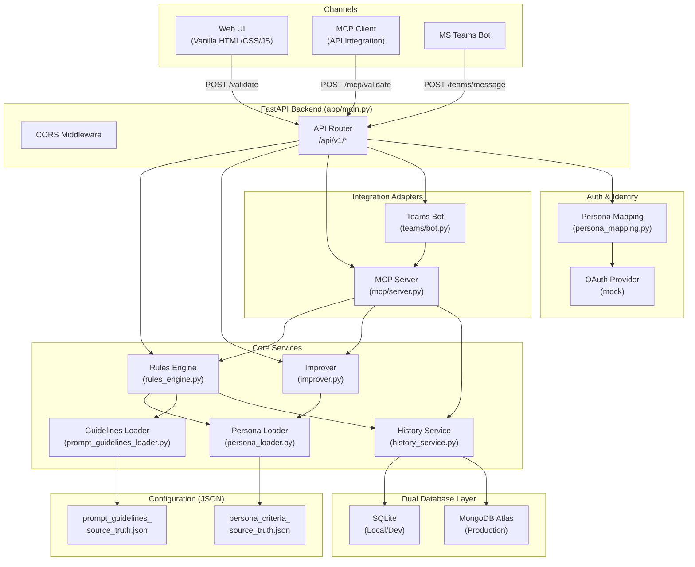
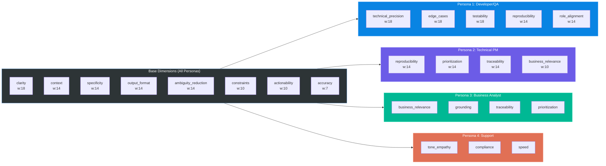
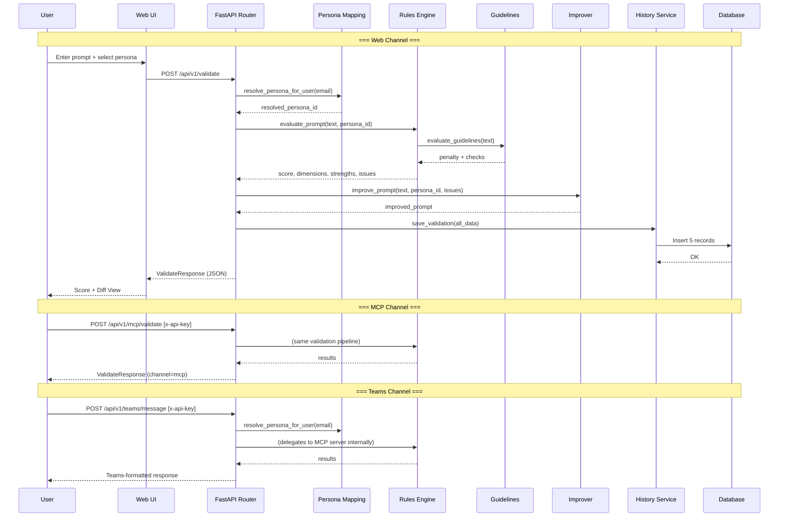
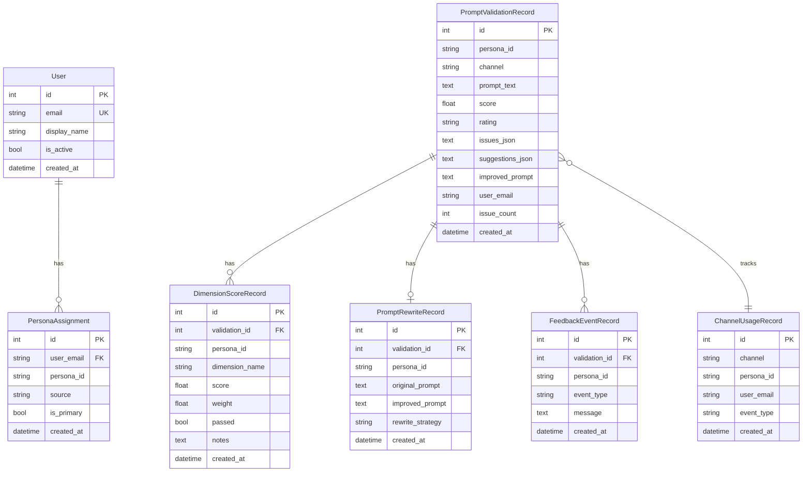
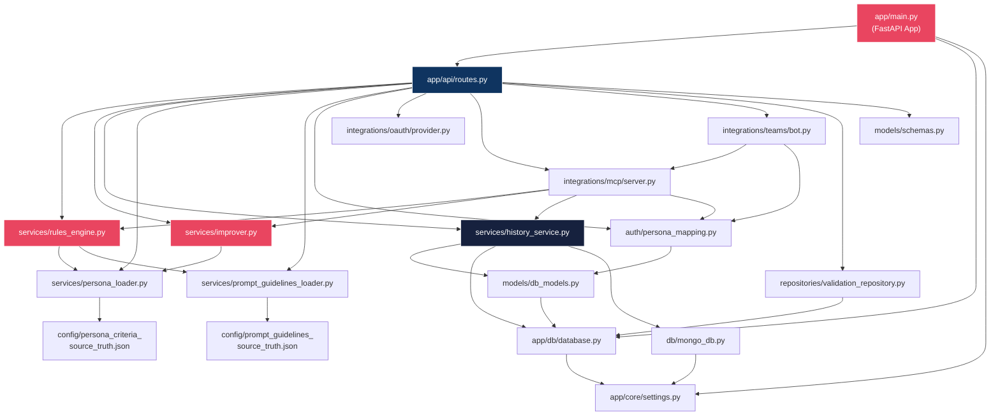
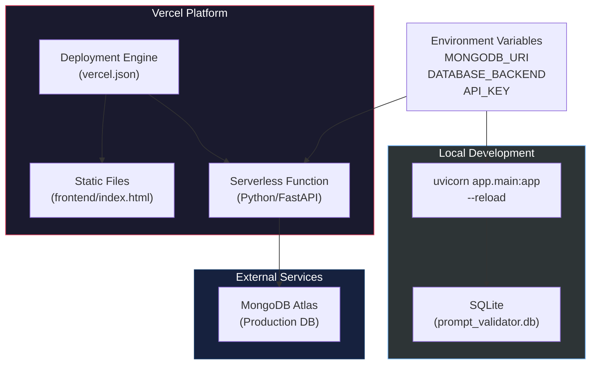
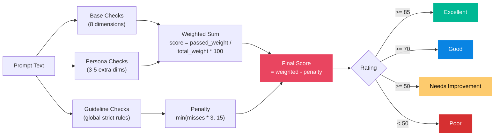
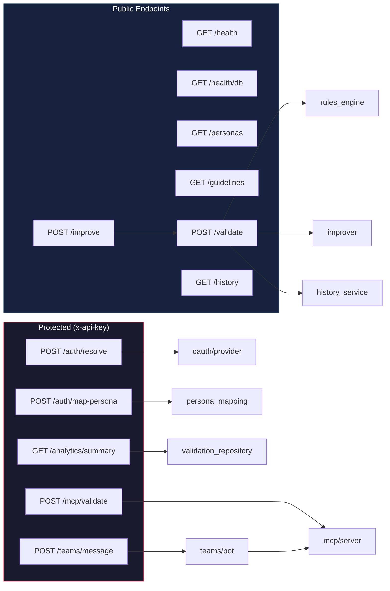

# Prompt Validator MVP - Architecture & Design Flow

## 1. System Architecture (High-Level)

---

## 2. Core Validation Workflow

```mermaid
flowchart TD
    START(["User Submits Prompt"]) --> INPUT["ValidateRequest<br/>prompt_text, persona_id,<br/>user_email, auto_improve"]

    INPUT --> CHECK_EMAIL{user_email provided<br/>AND persona_0?}
    CHECK_EMAIL -->|Yes| RESOLVE["resolve_persona_for_user()<br/>Auto-detect persona from DB"]
    CHECK_EMAIL -->|No| USE_GIVEN["Use provided persona_id"]
    RESOLVE --> LOAD_PERSONA
    USE_GIVEN --> LOAD_PERSONA

    LOAD_PERSONA["get_persona(persona_id)<br/>Load weights + keyword checks<br/>from JSON config"] --> VALIDATE_EMPTY{prompt_text<br/>empty?}

    VALIDATE_EMPTY -->|Yes| ERROR["HTTP 400:<br/>prompt_text cannot be empty"]
    VALIDATE_EMPTY -->|No| EVAL

    subgraph EVAL["evaluate_prompt()"]
        direction TB
        E1["1. Load persona weights<br/>(clarity, context, specificity, ...)"] --> E2["2. Run base dimension checks<br/>(regex + keyword detection)"]
        E2 --> E3["3. Run persona-specific checks<br/>(P1: tech, P2: PM, P3: BA, P4: support)"]
        E3 --> E4["4. Calculate weighted score<br/>score = (sum_passed / total_weight) * 100"]
        E4 --> E5["5. Evaluate guidelines<br/>(strict_mode penalty checks)"]
        E5 --> E6["6. Apply penalties<br/>final = score - min(misses * 3, 15)"]
        E6 --> E7["7. Collect strengths + issues"]
    end

    EVAL --> AUTO{auto_improve<br/>= True?}
    AUTO -->|Yes| IMPROVE["improve_prompt()<br/>Template-based rewriting<br/>per persona role"]
    AUTO -->|No| SKIP["improved = original"]
    IMPROVE --> RATE
    SKIP --> RATE

    RATE["Rating:<br/>>= 85 Excellent<br/>>= 70 Good<br/>>= 50 Needs Improvement<br/>< 50 Poor"] --> SAVE

    subgraph SAVE["save_validation()"]
        direction TB
        S1["PromptValidationRecord"] --> S2["DimensionScoreRecord<br/>(one per dimension)"]
        S2 --> S3["PromptRewriteRecord"]
        S3 --> S4["ChannelUsageRecord"]
        S4 --> S5["FeedbackEventRecord"]
    end

    SAVE --> RESPONSE(["ValidateResponse<br/>score, rating, strengths,<br/>issues, improved_prompt,<br/>dimension_scores,<br/>guideline_evaluation"])

    style EVAL fill:#1a1a2e,stroke:#e94560,color:#fff
    style SAVE fill:#16213e,stroke:#0f3460,color:#fff
    style RESPONSE fill:#0f3460,stroke:#e94560,color:#fff
```

---

## 3. Persona-Specific Scoring Dimensions

---

## 4. Multi-Channel Request Flow

---

## 5. Database Schema (Entity Relationship)

---

## 6. Component Dependency Graph

---

## 7. Deployment Architecture

---

## 8. Scoring Algorithm Flow

---

## 9. API Endpoint Map

---

## Key Architectural Decisions

| Decision | Choice | Rationale |
|----------|--------|-----------|
| Validation approach | Rules-based (regex/keyword) | Deterministic, fast, no LLM cost per validation |
| Improvement strategy | Template-based rewriting | Predictable structure, persona-specific context |
| Database | Dual SQLite/MongoDB | SQLite for dev speed, MongoDB Atlas for production scale |
| Auth | Mock OAuth + API key | MVP simplicity; swap to real OAuth later |
| Frontend | Vanilla HTML/CSS/JS | Zero build step, fast iteration for MVP |
| Integration pattern | Thin adapters over core | MCP and Teams reuse the same validation pipeline |
| Persona config | External JSON files | Non-developers can tune weights without code changes |
| Scoring | Weighted pass/fail per dimension | Transparent, explainable scores per persona |
